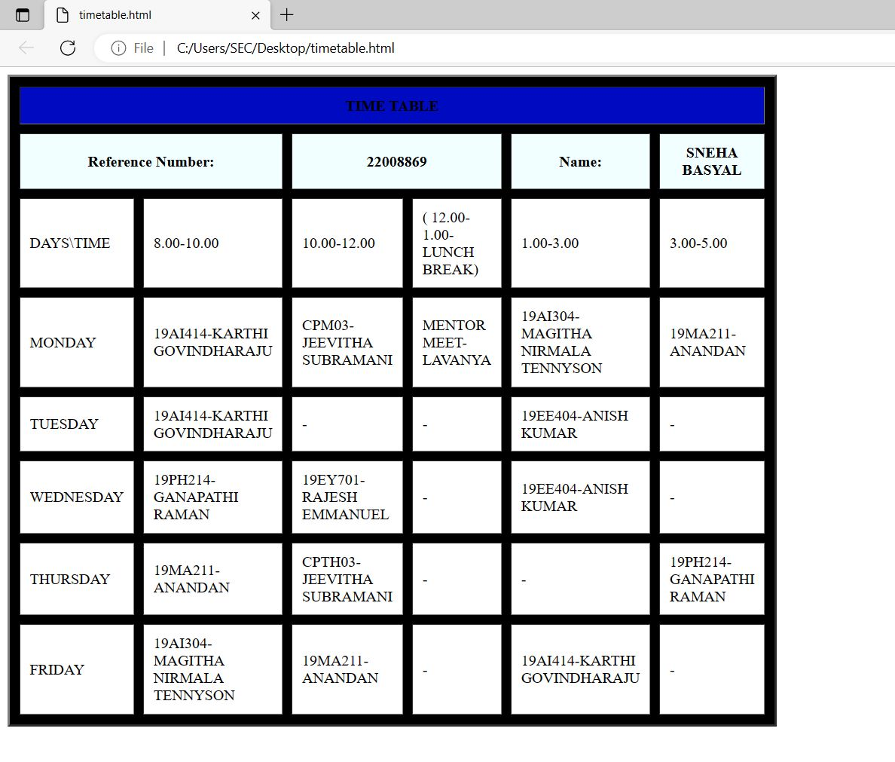

# Experiment_Time_Table

## AIM
To Write a html webpage page to display your timetable.

# ALGORITHM
### STEP 1
create a simple table using table tag
### STEP 2
Add header row using th tag
### STEP 3
Add your timetable
### STEP 4
Execute the program

# CODE
```
<TABLE BORDER="3" width="750" bgcolor="BLACK" cellspacing="10" cellpadding="10"> 
<TR> 
	<TH colspan="9" align="center" bgcolor="LILAC">TIME TABLE</TH>
</TR>   
<TR> 
	<TH colspan="2" width="25%" bgcolor="azure">Reference Number:</TH>
     <TH colspan="2" width="25%" bgcolor="azure">22008869</TH>
     <TH colspan="1" width="25%" bgcolor="azure">Name:</TH>
     <TH colspan="1" width="30%" bgcolor="azure">SNEHA BASYAL</TH> 
</TR>
<TR>
	<TD width="25%" bgcolor="white">DAYS\TIME</TD>
      <TD width="25%" bgcolor="white">8.00-10.00</TD> 
	<TD width="25%" bgcolor="white">10.00-12.00</TD>
	<TD width="25%" bgcolor="white">( 12.00-1.00-LUNCH BREAK)</TD>
     <TD width="25%" bgcolor="white">1.00-3.00</TD>
     <TD width="25%" bgcolor="white">3.00-5.00</TD>
     
</TR>
<TR>
     <TD width="25%" bgcolor="white">MONDAY</TD>
     <TD width="25%" bgcolor="white">19AI414-KARTHI GOVINDHARAJU</TD>
     <TD width="25%" bgcolor="white">CPM03-JEEVITHA SUBRAMANI</TD>
     <TD width="25%" bgcolor="white">MENTOR MEET-LAVANYA</TD>
     <TD width="25%" bgcolor="white">19AI304-MAGITHA NIRMALA TENNYSON</TD>
     <TD width="25%" bgcolor="white">19MA211-ANANDAN</TD>
     
</TR>
<TR> 
     <TD width="25%" bgcolor="white">TUESDAY</TD>
     <TD width="25%" bgcolor="white">19AI414-KARTHI GOVINDHARAJU</TD>
     <TD width="25%" bgcolor="white">-</TD>
     <TD width="25%" bgcolor="white">-</TD>
     <TD width="25%" bgcolor="white">19EE404-ANISH KUMAR</TD>
     <TD width="25%" bgcolor="white">-</TD>

</TR>
<TR> 
     <TD width="25%" bgcolor="white">WEDNESDAY</TD>
     <TD width="25%" bgcolor="white">19PH214-GANAPATHI RAMAN</TD>
     <TD width="25%" bgcolor="white">19EY701-RAJESH EMMANUEL</TD>
     <TD width="25%" bgcolor="white">-</TD>
     <TD width="25%" bgcolor="white">19EE404-ANISH KUMAR</TD>
     <TD width="25%" bgcolor="white">-</TD>

</TR>
<TR>
     <TD width="25%" bgcolor="white">THURSDAY</TD>
     <TD width="25%" bgcolor="white">19MA211-ANANDAN</TD>
     <TD width="25%" bgcolor="white">CPTH03-JEEVITHA SUBRAMANI</TD>
     <TD width="25%" bgcolor="white">-</TD>
     <TD width="25%" bgcolor="white">-</TD>
     <TD width="25%" bgcolor="white">19PH214-GANAPATHI RAMAN</TD>

</TR>
<TR>
     <TD width="25%" bgcolor="white">FRIDAY</TD>
     <TD width="25%" bgcolor="white">19AI304-MAGITHA NIRMALA TENNYSON</TD>
     <TD width="25%" bgcolor="white">19MA211-ANANDAN</TD>
     <TD width="25%" bgcolor="white">-</TD>
     <TD width="25%" bgcolor="white">19AI414-KARTHI GOVINDHARAJU</TD>
     <TD width="25%" bgcolor="white">-</TD>

</TR>
</TABLE>
```
# OUPUT

